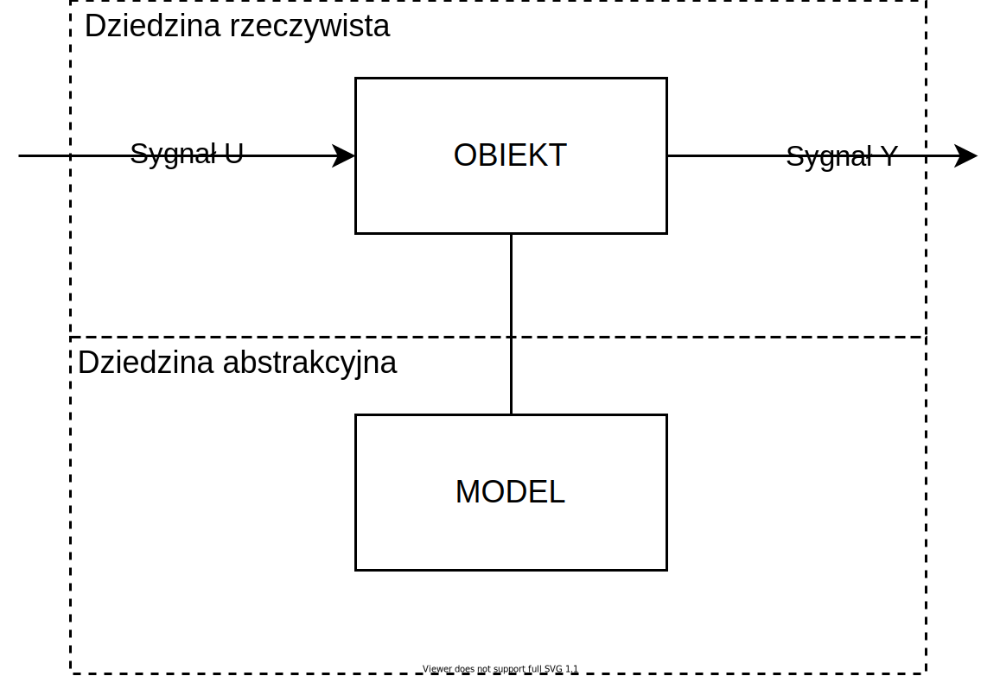
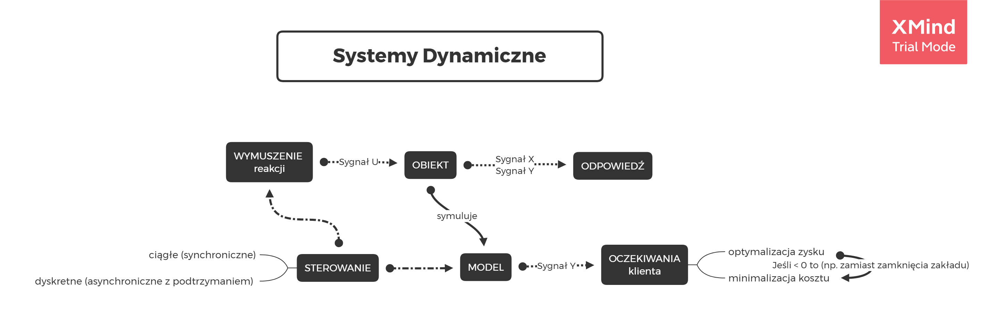
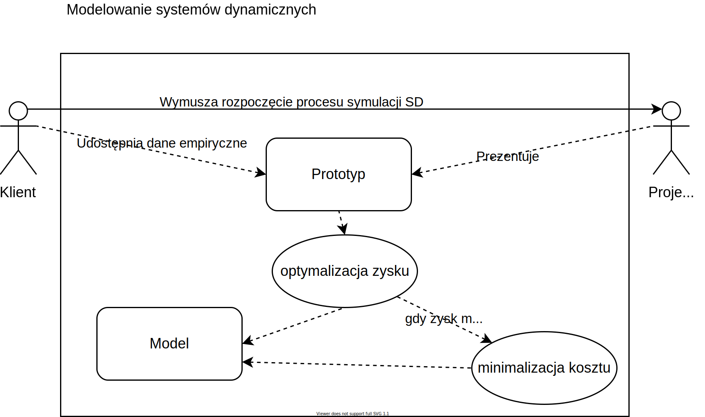

# [Systemy Dynamiczne](https://coggle.it/diagram/X1pYv04r0v3pMzn-/t/-/35e679aefe319b534d32b8339196662afced338bf7a6c6bd9cfcdc6709ff4f98) - Mapy myśli
### *Mapy myśli* trakcie tworzenia :

[Sygnał :zap:](https://coggle.it/diagram/X1j0eG89oR9IEMgE/t/sygna%C5%82-zap/a41b41437749651ef746a7f43989e6f4ae836821485ebf3ca3dc237364c51249)
[Obiekt :film_projector:](https://coggle.it/diagram/X1j6TG89oQteENAx/t/obiekt-film_projector/d20da092af43109ed12b50416ec609243b78d0a4bb31689ccbc3d0acc9b97edf)
[Model :thought_balloon:](https://coggle.it/diagram/X1j5ak37tNCUiQML/t/model-thought_balloon/08be4cfb1e4ba2a52af843f003a05e8496bd500e76400278ed1be801fba9d828)
=========

#### Podstawy 

#### Opis

#### Dziedzna określa znaczenie słów. 
> Dla przykładu weźmy słowo: **switch**

> Dla każdego technika będzie znaczyć co innego:  
*elektronik* o przycisku, 
*programista* o instrukcji warunkowej, 
a *informatyk* pomyśli o urządzeniu sieciowym. 

> Słowo jest jedno, ale kontekst czy też scena się zmienia, dlatego ... jest to język formalny (jak Matematyka), który znajdzie zastosowanie nie tylko w ściśle inżynierskim słownictwie.

### FAQ

- Czym różni się obiekt od modelu?

> **Dziedziną**  

> abstrakcja jest uproszczeniem rzeczywistości, w sensie formalnym badań

>   * Obiekt - dziedzina Rzeczywista (to co jest obserwowalne)
>   * Model - dziedzina Abstrakcyjna (nasze wyobrażenia jaki obiekt jest)
    
- Co to są mapy myśli?

> Jest to płaszczynza rozwoju dziedzin naukowych empiryczną metodą mat 👆 teo 👇 info o reprezentacji poznawczej w paradygmacie natężenia wizualnego (inter) oraz napięcia atmosferycznego (multi)

- Jaki jest cel?

> Cel to optymalne wykożystanie kwantu czasu razem z parametrem przestrzeni poprzez obiekt. Czas nie jest celem, jest jakby iluzorycznym tykaniem towarzyszącym poszukiwaniu prawdy.

# Notatki :)    
    
  > Problem nieporozuienia nie leży w moności języków, ale w sposobie ich interpretacji.
  
Dlaczego używać map myśli?
https://youtu.be/5nTuScU70As  
Mapy myśli angażują kilka zmysłów poznawczych równocześnie. Przesłanie: uczmy dzieci robić mapy myśli. 

> Przy stawianiu tezy, istotą jest poszukiwanie wielowymiarowej stacjonarnrnej liniowo symetrii. Suma przeciwności nie daje gwarancji pełnej symetrii, dlatego nie należy przyjmować zera jako wartość normalną.

Przykłady lokalnych i globalnych symetrii dla systemu apikacji mobilnej.
[coggle.it](https://coggle.it/diagram/X3_hahiU9AZJpjAe/t/system-aplikacji-mobilnej)

ETAPY wykładu "multi disciplinae est progressio itinere"
  - Teoria
  - sytneza - dla mnie najbardziej interesująca część, czyli jak wykładowca stosuje w praktyce to o czym mówi (np. ostatnio realizowany projekt)
  - praktyka
    
 ### Literatura i wzorce: 
  
[1] Jan T. Duda "Modele matematyczne, struktury i algorytmy nadrzędnego sterowania komputerowego"

[2] Tomasz Zieliński "Reprezentacje sygnałów niestacjonarnych typu czas-częstotliwość i czas-skala"

[3] Witold Byrski "Obserwacja i sterowanie w systemach dynamicznych"

[4] Edward Nowak "Zarys metod ekonometrii Zbiór zadań"

[5] Tadeusz Kaczorek **"Teoria sterowania i systemów"**

[6] Michał Szafrański **"Zaufanie, waluta przyszłości"**

[7] Albert Einstein "Sczególna teoria względności"

[8] Krzysztof Kieślowski "Zbliżenie" - Sens dąży do jedności

[9] [Krzysztof](https://youtu.be/FmSsNUkiGM8?t=1179) [Meissner](https://www.youtube.com/watch?v=HhSdMIeNRHU) "Na początku było prawo"

[10] [Krzysztof Zanussi](https://youtu.be/hw2QYCrbAcY?t=395) "Uczyń z swojego życia arcydzieło"

## Przypadki użycia (Use Case from UML)

