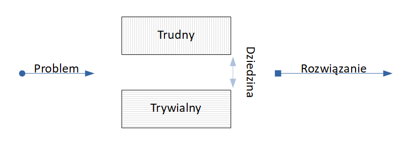

# [Systemy Dynamiczne](https://coggle.it/diagram/X1pYv04r0v3pMzn-/t/-/35e679aefe319b534d32b8339196662afced338bf7a6c6bd9cfcdc6709ff4f98)
### Poniżej diagramy relatywnego słownictwa (w trakcie tworzenia): 

[Sygnał :zap:](https://coggle.it/diagram/X1j0eG89oR9IEMgE/t/sygna%C5%82-zap/a41b41437749651ef746a7f43989e6f4ae836821485ebf3ca3dc237364c51249)
[Obiekt :film_projector:](https://coggle.it/diagram/X1j6TG89oQteENAx/t/obiekt-film_projector/d20da092af43109ed12b50416ec609243b78d0a4bb31689ccbc3d0acc9b97edf)
[Model :thought_balloon:](https://coggle.it/diagram/X1j5ak37tNCUiQML/t/model-thought_balloon/08be4cfb1e4ba2a52af843f003a05e8496bd500e76400278ed1be801fba9d828)
=========

#### Podstawy  obserwowalnoci 

#### Opis

#### Dziedzna określa ograniczenie *warstwy eksperckiej* znaczenia słów
> Dla przykładu "eksperymentu myślowego" weźmy słowo: **switch**

> Dla każdego technika "myl" bdzie znaczy co innego:  
*elektronik* zapewne opowie o przycisku, 
*programista* o instrukcji warunkowej, 
a *informatyk* przykadowo pomyli o urzdzeniu sieciowym. 

> Słowo jest jedno, ale kontekst czy też scena się zmienia, dlatego .. . "Połącz kropki" to język formalny (jak Matematyka), który znajdzie zastosowanie nie tylko w "ściśle wyważonym" inżynierskim słownictwie.

### FAQ

- Czym różni się obiekt od modelu?

> **Dziedziną**  

> abstrakcja jest uproszczeniem rzeczywistości, w sensie formalnym badań. Najczęściej mówi się o umownym, warstwowym modelu odpowiedzalności i zależności.

>   * Obiekt - dziedzina Rzeczywista (to co jest obserwowalne)
>   * Model - dziedzina Abstrakcyjna (nasze wyobrażenia jaki obiekt jest)
  
- Dlaczego do notowania wykorzystywane są mapy myśli i ciągi przyczynowo skutkowe?

> Jest to przestrzeń dla rozwoju dziedzin naukowych nierozłącznie empirycznych. Metoda mat 👆 teo 👇 info o reprezentacji kierunku perspektywiczno-poznawczej paradygmatu: natężenia wizji (inter) czasowej oraz napięcia atmosfery (multi) przestrzennej. W nauce w przypadku niż szczególny bitowy (zdarzenie o prawdopodobieństwie 1/2) teoria przeczy praktyce. (Wynika to z komputerowego sposobu wykonywania obliczeń)

------------------
Słowem, bardziej metaforycznie/alegoryczne:

- Co jest potrzebne?

> Po prostu, zanim pomyślisz o drodze, spójrz w górę, następnie w drogę.

> Cel to optymalne wykorzystanie kwantu czasu poprzez współobiekt inter?logiczny i zorientowanie parametrów przestrzeni. Czas nie jest celem, jest jakby iluzorycznym tykaniem towarzyszącym poszukiwaniu prawidłowości na płaszczyźnie dziedziny nauk. O dekompozycji Matematycznej spróbuj napisać Ty.

# Notatki :)    

  > Problem nieporozuienia nie leży w moności języków, ale w sposobie ich interpretacji.

  > Będąc początkiem drogi przydaje się talent jak egoizm altruisty, trzeba umieć wykożystać znaczenie, poznać język swój. Bez tego dłuższa droga bezcelowa jest, dlatego należy zadbać o podstawy.
  
  W uproszczeniu wyobrażam sobie czas jak taką pionową linię, niczym rozwijane jojo, na której rotuje się układanka, tak jakby kostka Rubika, dla każdego poruszenia węzła.
  
  Przedmiot rozmowy o potrzebach pokornych. Powód by opanować skomponowane wiązanie ulegające kształtowi gawitacji w czasie, cel silnego podobieństwa/posłuszeństwa nuklearnego oddziaływaniu samo-realizacji przestrzennej. Wiązanie nie wyszło, osobiście nazwywam to "kryzysem zaufania" tylko sobie jako obrazowej strukturze.
  
Dlaczego używać map myśli?
https://youtu.be/5nTuScU70As  
Mapy myśli angażują kilka zmysłów poznawczych równocześnie. Przesłanie: uczmy dzieci robić notatki.

> Przy stawianiu tezy, istotą jest poszukiwanie wielowymiarowej stacjonarnrnej liniowo symetrii. Suma przeciwności nie daje gwarancji pełnej symetrii (teoretycznie dzięki temu istniejemy), dlatego nie należy przyjmować zera jako wartość normalną.

Przykłady lokalnych i globalnych symetrii dla systemu apikacji mobilnej.

Etapy wykładu "multi disciplinae itinere progressio est"
  - teoria
  - sytneza - dla mnie najbardziej interesująca część, czyli jak wykładowca stosuje w praktyce to co przekazuje (np. ostatnio realizowany projekt)
  - praktyka

 ### Literatura i wzorce: 
[0] Anne [Urai](docs/urai.pdf) "BIASES IN PERCEPTUAL"

[1] Jan T. Duda "Modele matematyczne, struktury i algorytmy nadrzędnego sterowania komputerowego"

[2] Tomasz Zieliński "Reprezentacje sygnałów niestacjonarnych typu czas-częstotliwość i czas-skala"

[3] Witold Byrski "Obserwacja i sterowanie w systemach dynamicznych"

[4] Edward Nowak "Zarys metod ekonometrii Zbiór zadań"

[5] Tadeusz Kaczorek **"Teoria sterowania i systemów"**

[6] Michał Szafrański **"Zaufanie, waluta przyszłości"**

[7] Albert Einstein "Sczególna teoria względności"

[8] Krzysztof Kieślowski "Zbliżenie" - Sens dąży do jedności

[9] [Krzysztof](https://youtu.be/FmSsNUkiGM8?t=1179) [Meissner](https://www.youtube.com/watch?v=HhSdMIeNRHU) "Na początku było prawo"

[10] [Krzysztof Zanussi](https://youtu.be/hw2QYCrbAcY?t=395) "Uczyń z swojego życia arcydzieło"

> Dziedzina rozwiązywania ? problemów
> 

> Postawmy sobie teraz pytanie, jak subiektywnie są rozumiane słowa użyte na powyższym diagramie?

--------------
Problem/przypadek/węzeł -

--------------
Dziedzina/czasoprzestrzeń/ograniczenia -

--------------
Wyprostowanie/zagęszczenie/rozwiązanie -

## Przypadki użycia (Use Case from UML)

